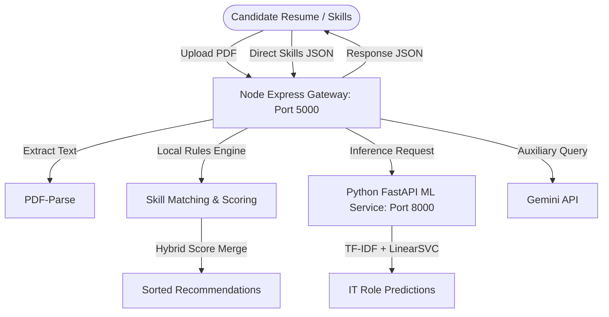

# CareerMapper — Backend Freeze Documentation

This document records the frozen state of the backend components before proceeding to frontend integration. No changes should be made to this frozen API boundary or logic unless a frontend integration test later identifies a defect.

---

## 1. Current Architecture



---

## 2. Working API Endpoints

All endpoints bind to **Port 5000**:

### `GET /health`
* **Purpose**: Performs system sanity and service connectivity checks.
* **Response**: `{"status":"ok"}`

### `POST /extract-skills`
* **Purpose**: Accepts a resume PDF file and extracts normalized skills, detected domains, and domain weights.
* **Payload**: Form-data containing `file` (application/pdf).
* **Response**:
  ```json
  {
    "skills": [
      { "name": "React.js", "level": "advanced" },
      { "name": "Node.js", "level": "intermediate" }
    ],
    "domain": "IT",
    "confidence": 100,
    "domains": [
      { "name": "IT", "score": 100 }
    ]
  }
  ```

### `POST /detect-domain`
* **Purpose**: Accepts manual skill inputs and detects the domain of expertise.
* **Payload**:
  ```json
  {
    "skills": [
      { "name": "react", "level": "advanced" }
    ]
  }
  ```
* **Response**: Same format as `/extract-skills`.

### `POST /match-roles`
* **Purpose**: Calculates hybrid matching scores using both Rule-Engine coverage and ML-confidence predictions.
* **Payload**:
  ```json
  {
    "skills": [
      { "name": "react", "level": "advanced" },
      { "name": "node", "level": "intermediate" }
    ],
    "domain": "IT" // Optional
  }
  ```
* **Response**:
  ```json
  {
    "recommendations": [
      {
        "role": "Frontend Developer",
        "score": 78,
        "domain": "IT",
        "matchedSkills": ["react"],
        "missingSkills": ["javascript", "html", "css", "dom", "responsive design", "tailwind", "redux", "figma", "git"]
      }
    ]
  }
  ```

### `POST /suggest-domain`
* **Purpose**: Calls Gemini to suggest domain category for obscure/unknown skills.
* **Payload**: `{"skill": "blockchain"}`
* **Response**: `{"domain": "IT", "reason": "..."}`

---

## 3. ML Service Configuration

* **Runtime**: Python `3.11.9` virtual environment (`.venv311`)
* **Endpoint**: `http://localhost:8000`
* **Mechanism**:
  * TF-IDF vectorizer mapping inputs to a 13-class `LinearSVC` model.
  * Outputs mapped to pseudo-probabilities via Platt-scaling/softmax.
* **Hybrid Score Calibration**:
  * If ML prediction confidence is `< 35%`, it is ignored as weak evidence, preserving the high-fidelity rule-based score.
  * If confidence is `>= 35%`, the scores are combined: `Math.round(RuleScore * 0.5 + (MLConfidence * 100) * 0.5)`.

---

## 4. Environment Variables Required

Configured in `backend/.env`:

* `PORT=5000` — Express server port.
* `MONGO_URI=mongodb://localhost:27017/careermapper` — MongoDB connection string.
* `ML_SERVICE_URL=http://localhost:8000` — ML service host.
* `GEMINI_API_KEY=PASTE_YOUR_GEMINI_API_KEY_HERE` — Optional auxiliary Gemini key.

---

## 5. MongoDB Optional / Offline Behavior

* **Startup Resilience**: The backend starts successfully even if MongoDB is offline, writing a warning to the logs: `[WARNING] MongoDB unavailable — running in offline mode.`
* **Core Functions**: Skill matching, extraction, normalization, and API recommendation logic operate 100% locally from static JSON definitions, meaning MongoDB availability is not required for standard pipeline calls.

---

## 6. Gemini Configuration

* **Guard Protection**: If the `GEMINI_API_KEY` is missing, empty, or set to the placeholder string, the backend returns a controlled **`503 Service Unavailable`** response instead of throwing unhandled exceptions.
* **Timeout Protection**: Queries to Gemini have a strict `5000ms` network timeout enforced by Axios.

---

## 7. Passed Test Suites

All local validation frameworks have completed with **100% pass rates**:

1. `node test-validation.js` — Core skill normalization, domain isolation, and edge-case validation.
2. `node test-pipeline-validation.js` — Text parsing, sentence boundary proximity, and repeated skill highest-level retention.
3. `node tests/test_ml_integration.js` — ML integration gates, offline fallbacks, and connection timeout recoverability (8/8 passes).
4. `node test-runtime-verification.js` — End-to-end API scenario validation (12/12 passes).

---

## 8. Known Blocked Test

* **Test 29 (Gemini real API-key verification)**: Remaining blocked until a real valid Gemini API key is configured. Offline gracefully handles this using the controlled 503 error mechanism.
