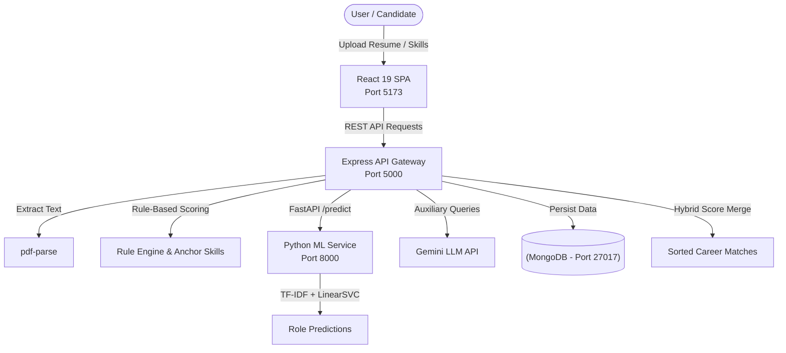

# CareerMapper 🚀

**CareerMapper** is an AI-powered career intelligence and roadmap platform that analyzes candidate resumes or manual skill profiles, detects career domains, predicts target job role matches using a hybrid scoring system (Rule Engine + Scikit-Learn Machine Learning), and provides tailored learning roadmaps and skill gap analysis.

---

## 🏗 System Architecture

CareerMapper consists of three primary services working together:



### Stack & Components

- **Frontend**: React 19, TypeScript, Vite, Tailwind CSS, Lucide Icons, GSAP, Recharts (Default Dev Server: `http://localhost:5173`)
- **Backend API Gateway**: Node.js, Express 5, Mongoose, Multer, Axios, PDF-Parse (`http://localhost:5000`)
- **ML Inference Service**: Python 3.11, FastAPI, Scikit-Learn (LinearSVC & TF-IDF Vectorizer), Joblib (`http://localhost:8000`)
- **Database**: MongoDB (`mongodb://localhost:27017/careermapper`) with offline fallback support
- **External AI Integrations**: Google Gemini API (`gemini-2.5-flash`) for fallback domain suggestions

---

## ⚡ Quick Start & Setup

### Prerequisites

- **Node.js**: v18+ or v20+
- **Python**: v3.10 or v3.11
- **MongoDB** (Optional, backend automatically operates in offline mode if unavailable)

---

### 1. Backend Setup (Port 5000)

```bash
cd backend
npm install
```

Configure your environment file `backend/.env`:
```env
PORT=5000
MONGO_URI=mongodb://localhost:27017/careermapper
ML_SERVICE_URL=http://127.0.0.1:8000
GEMINI_API_KEY=your_gemini_api_key_here
```

Start the backend server:
```bash
npm start
# or for live reload:
npm run dev
```

---

### 2. Frontend Setup (Port 5173)

```bash
cd frontend
npm install
npm run dev
```

Open `http://localhost:5173` in your browser.

---

### 3. ML Inference Service Setup (Port 8000)

```bash
cd ml
python -m venv .venv
# Windows PowerShell:
.\.venv\Scripts\activate
# Linux/macOS:
source .venv/bin/activate

pip install -r requirements.txt
uvicorn inference_service:app --host 127.0.0.1 --port 8000 --reload
```

---

## 📡 Key API Endpoints (Backend - Port 5000)

| Endpoint | Method | Purpose | Payload / Parameters |
| :--- | :---: | :--- | :--- |
| `/extract-skills` | `POST` | Parses PDF resume, extracts skills, levels, and domain | `FormData: file (PDF)` |
| `/detect-domain` | `POST` | Detects domain classification from manual skill list | `{"skills": [{"name": "react", "level": "advanced"}]}` |
| `/match-roles` | `POST` | Calculates hybrid Rule + ML role recommendations & skill gaps | `{"skills": [...], "domain": "IT"}` |
| `/suggest-domain` | `POST` | LLM fallback domain lookup via Gemini API | `{"skill": "quantum computing"}` |

---

## 📂 Project Structure

```
CareerMapper/
├── backend/                       # Express.js REST API Gateway (Port 5000)
│   ├── src/
│   │   ├── controllers/           # Request & response controllers
│   │   ├── data/                  # Static JSON databases (domains.json, roles.json, roadmaps.json)
│   │   ├── models/                # Mongoose schemas
│   │   ├── routes/                # Express router definitions
│   │   ├── services/              # Core domain, rule, resume & gemini services
│   │   └── utils/                 # Skill normalizer & proximity level detector
│   └── tests/                     # Validation & integration test suites
│
├── frontend/                      # React 19 + TypeScript + Vite SPA (Port 5173)
│   ├── src/
│   │   ├── components/            # Reusable UI components & layouts
│   │   ├── pages/                 # Route pages (Landing, Upload, Manual, Recommendations, Role Details)
│   │   ├── services/              # API abstraction layer (api.ts)
│   │   ├── data/                  # Static roadmap & SVG assets
│   │   └── types/                 # TypeScript interfaces & domain contracts
│   └── vite.config.ts             # Vite configuration
│
├── ml/                            # Python FastAPI ML Inference Engine (Port 8000)
│   ├── models/                    # Pre-trained joblib weights (LinearSVC, TF-IDF Vectorizer)
│   ├── utils/                     # InferenceGuard safety layer & spam sanitizer
│   └── inference_service.py       # FastAPI endpoints (/health, /predict)
│
└── docs/                          # Architecture diagrams & documentation assets
```

---

## 📚 Documentation & Reference Guides

- [Project Architecture Guide](file:///c:/Users/Lenovo/Downloads/CareerMapper-main/PROJECT_ARCHITECTURE_GUIDE.md) — Comprehensive feature-to-code mapping, algorithms, and logic flow
- [Roadmap Feature & Developer Guide](file:///c:/Users/Lenovo/Downloads/CareerMapper-main/ROADMAP_FEATURE_GUIDE.md) — Interactive SVG roadmap architecture and developer tutorial for adding new roadmaps
- [Backend Freeze Documentation](file:///c:/Users/Lenovo/Downloads/CareerMapper-main/BACKEND_FREEZE.md) — Complete API contract, scoring weights, and freeze state
- [Postman Testing Guide](file:///c:/Users/Lenovo/Downloads/CareerMapper-main/careermapper_postman_testing.md) — API request examples and test collection guide
- [Skill Extraction Audit](file:///c:/Users/Lenovo/Downloads/CareerMapper-main/skill_extraction_audit.md) — Resume parsing accuracy and extraction benchmarks
- [Frontend Guide](file:///c:/Users/Lenovo/Downloads/CareerMapper-main/frontend/README.md) — Frontend component patterns & state management
- [ML Guide](file:///c:/Users/Lenovo/Downloads/CareerMapper-main/ml/README.md) — Model training pipeline & dataset details
