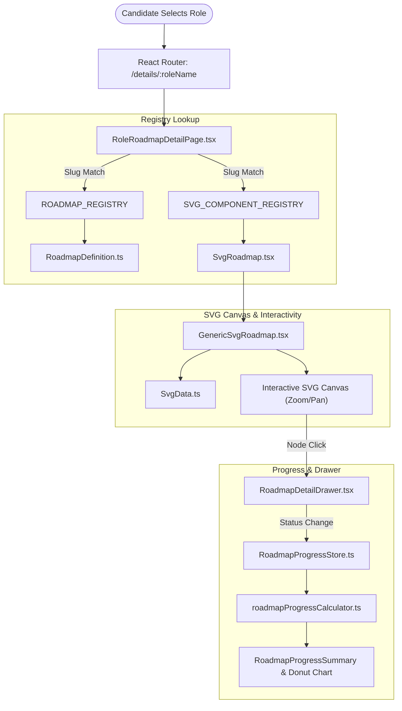

# CareerMapper — Interactive Roadmap Feature & Developer Guide

This document provides a comprehensive breakdown of the **Interactive Roadmap System** in CareerMapper, detailing its frontend/backend architecture, data models, state management, and a step-by-step developer tutorial for adding new career roadmaps.

---

## 🗺️ 1. Roadmap System Architecture

The Roadmap feature enables candidates to view interactive, graphical learning pathways for technical career roles, inspect individual node topic drawers, mark learning progress, and track overall completion percentages.



### Core Architecture Layers

1. **Routing & Registry Layer**:
   - Entry page: [`RoleRoadmapDetailPage.tsx`](file:///c:/Users/Lenovo/Downloads/CareerMapper-main/frontend/src/pages/RoleRoadmapDetailPage.tsx)
   - Resolves role parameters (e.g., `frontend`, `ai-engineer`, `devops`) to structured TS definitions and SVG rendering components via registry maps.

2. **SVG Render Engine**:
   - Engine: [`GenericSvgRoadmap.tsx`](file:///c:/Users/Lenovo/Downloads/CareerMapper-main/frontend/src/components/roadmap/GenericSvgRoadmap.tsx)
   - Renders vector geometries, clickable nodes, hover effects, text labels, directional arrows, and status color overlays (`done`, `in-progress`, `skip`, `pending`).

3. **Drawer & Metadata Layer**:
   - Component: [`RoadmapDetailDrawer.tsx`](file:///c:/Users/Lenovo/Downloads/CareerMapper-main/frontend/src/components/roadmap/RoadmapDetailDrawer.tsx)
   - Slide-over sheet presenting topic lists, descriptions, official documentation URLs, and interactive status selector buttons.

4. **Progress Store**:
   - Store: [`RoadmapProgressStore.ts`](file:///c:/Users/Lenovo/Downloads/CareerMapper-main/frontend/src/services/RoadmapProgressStore.ts)
   - Calculator: [`roadmapProgressCalculator.ts`](file:///c:/Users/Lenovo/Downloads/CareerMapper-main/frontend/src/utils/roadmapProgressCalculator.ts)
   - Manages persistent node completion states (LocalStorage + Backend Sync), calculating total and section-wise completion percentages.

---

## 📋 2. Supported Roadmaps (14 Built-In Roles)

| Role Key | Role Title | Definition File | SVG Dataset File |
| :--- | :--- | :--- | :--- |
| `frontend` / `frontend-developer` | Frontend Developer | `frontendRoadmapDefinition.ts` | `frontendSvgData.ts` |
| `backend` / `backend-developer` | Backend Developer | `backendRoadmapDefinition.ts` | `backendSvgData.ts` |
| `fullstack` / `full-stack` | Fullstack Developer | `fullstackRoadmapDefinition.ts` | `fullstackSvgData.ts` |
| `devops` / `devops-engineer` | DevOps Engineer | `devopsRoadmapDefinition.ts` | `devopsSvgData.ts` |
| `android` / `android-developer` | Android Developer | `androidRoadmapDefinition.ts` | `androidSvgData.ts` |
| `ios` / `ios-developer` | iOS Developer | `iosRoadmapDefinition.ts` | `iosSvgData.ts` |
| `ai-engineer` | AI Engineer | `aiEngineerRoadmapDefinition.ts` | `aiEngineerSvgData.ts` |
| `data-analyst` | Data Analyst | `dataAnalystRoadmapDefinition.ts` | `dataAnalystSvgData.ts` |
| `data-engineer` | Data Engineer | `dataEngineerRoadmapDefinition.ts` | `dataEngineerSvgData.ts` |
| `devsecops` | DevSecOps Expert | `devSecOpsRoadmapDefinition.ts` | `devSecOpsSvgData.ts` |
| `postgresql-dba` | PostgreSQL DBA | `postgresqlDbaRoadmapDefinition.ts` | `postgresqlDbaSvgData.ts` |
| `machine-learning` | Machine Learning Engineer | `machineLearningRoadmapDefinition.ts` | `machineLearningSvgData.ts` |
| `ai-data-scientist` | AI & Data Scientist | `aiDataScientistRoadmapDefinition.ts` | `aiDataScientistSvgData.ts` |
| `blockchain` | Blockchain Developer | `blockchainRoadmapDefinition.ts` | `blockchainSvgData.ts` |
| `software-architect` | Software Architect | `softwareArchitectRoadmapDefinition.ts` | `softwareArchitectSvgData.ts` |
| `qa` / `qa-engineer` | QA Engineer | `qaEngineerRoadmapDefinition.ts` | `qaEngineerSvgData.ts` |

---

## 🛠️ 3. Developer Guide: How to Add a New Roadmap

Follow this 5-step tutorial to add a new career roadmap (e.g. `cyber-security`, `cloud-architect`, `flutter-developer`).

---

### Step 1: Create the Roadmap Definition File

Create `frontend/src/data/cyberSecurityRoadmapDefinition.ts`:

```typescript
import type { RoadmapDefinition } from '../types/roadmap';

export const CYBER_SECURITY_ROADMAP_DEFINITION: RoadmapDefinition = {
  id: 'cyber-security',
  title: 'Cyber Security Engineer',
  description: 'Master ethical hacking, network security, cryptography, SIEM, and incident response.',
  domain: 'IT',
  sections: [
    {
      id: 'fundamentals',
      title: '1. Fundamentals & Networking',
      nodes: [
        {
          id: 'networking-basics',
          title: 'TCP/IP & OSI Model',
          description: 'Understand packet flows, IP addressing, subnets, and protocols.',
          topics: ['OSI 7 Layers', 'TCP vs UDP', 'DNS & DHCP', 'Subnetting', 'Wireshark'],
          resources: [
            { title: 'Network Fundamentals Guide', url: 'https://example.com/net-guide' }
          ]
        },
        {
          id: 'linux-basics',
          title: 'Linux CLI & Administration',
          description: 'Master bash shell scripting, file permissions, and system logging.',
          topics: ['File Permissions', 'SSH Security', 'Bash Scripting', 'Systemd'],
          resources: [
            { title: 'Linux Command Line Notes', url: 'https://example.com/linux' }
          ]
        }
      ]
    },
    {
      id: 'security-tools',
      title: '2. Security Operations & Tools',
      nodes: [
        {
          id: 'siem-soar',
          title: 'SIEM & SOC Operations',
          description: 'Monitor logs and analyze threats using Splunk and Elastic SIEM.',
          topics: ['Log Aggregation', 'Threat Hunting', 'Splunk Queries', 'Incident Response'],
          resources: [
            { title: 'Splunk Beginner Tutorial', url: 'https://example.com/splunk' }
          ]
        }
      ]
    }
  ]
};
```

---

### Step 2: Create the SVG Geometries Dataset File

Create `frontend/src/data/cyberSecuritySvgData.ts`:

```typescript
export interface SvgElementItem {
  id: string;
  type: 'rect' | 'text' | 'path' | 'g';
  x?: number;
  y?: number;
  width?: number;
  height?: number;
  d?: string;
  text?: string;
  className?: string;
  fill?: string;
  stroke?: string;
  fontSize?: number;
}

export const CYBER_SECURITY_SVG_VIEWBOX = "0 0 1000 1200";

export const CYBER_SECURITY_SVG_DATASET: SvgElementItem[] = [
  // Background / Canvas Connector Paths
  {
    id: 'path-1',
    type: 'path',
    d: 'M 210 210 L 210 310',
    stroke: '#64748b',
    className: 'roadmap-path'
  },
  // Node 1 Geometry
  {
    id: 'networking-basics',
    type: 'rect',
    x: 100,
    y: 150,
    width: 220,
    height: 60,
    fill: '#1e293b',
    stroke: '#3b82f6',
    className: 'roadmap-node-clickable'
  },
  {
    id: 'text-networking-basics',
    type: 'text',
    x: 210,
    y: 185,
    text: 'TCP/IP & OSI Model',
    className: 'node-label',
    fill: '#f8fafc'
  },
  // Node 2 Geometry
  {
    id: 'linux-basics',
    type: 'rect',
    x: 100,
    y: 310,
    width: 220,
    height: 60,
    fill: '#1e293b',
    stroke: '#3b82f6',
    className: 'roadmap-node-clickable'
  },
  {
    id: 'text-linux-basics',
    type: 'text',
    x: 210,
    y: 345,
    text: 'Linux CLI & Admin',
    className: 'node-label',
    fill: '#f8fafc'
  }
];
```

---

### Step 3: Create the Component Wrapper

Create `frontend/src/components/roadmap/CyberSecuritySvgRoadmap.tsx`:

```typescript
import React from 'react';
import { GenericSvgRoadmap } from './GenericSvgRoadmap';
import { CYBER_SECURITY_SVG_DATASET, CYBER_SECURITY_SVG_VIEWBOX } from '../../data/cyberSecuritySvgData';

interface SvgRoadmapWrapperProps {
  onNodeStatusChange?: () => void;
  onSelectNode?: (nodeId: string) => void;
}

export const CyberSecuritySvgRoadmap: React.FC<SvgRoadmapWrapperProps> = ({
  onNodeStatusChange,
  onSelectNode
}) => {
  return (
    <GenericSvgRoadmap
      roadmapId="cyber-security"
      title="Cyber Security Engineer"
      viewBox={CYBER_SECURITY_SVG_VIEWBOX}
      dataset={CYBER_SECURITY_SVG_DATASET}
      onNodeStatusChange={onNodeStatusChange}
      onSelectNode={onSelectNode}
    />
  );
};

export default CyberSecuritySvgRoadmap;
```

---

### Step 4: Register in `RoleRoadmapDetailPage.tsx`

Open [`RoleRoadmapDetailPage.tsx`](file:///c:/Users/Lenovo/Downloads/CareerMapper-main/frontend/src/pages/RoleRoadmapDetailPage.tsx):

1. **Add Imports**:
```typescript
import { CYBER_SECURITY_ROADMAP_DEFINITION } from '../data/cyberSecurityRoadmapDefinition';
import CyberSecuritySvgRoadmap from '../components/roadmap/CyberSecuritySvgRoadmap';
```

2. **Register in `ROADMAP_REGISTRY`**:
```typescript
const ROADMAP_REGISTRY: Record<string, RoadmapDefinition> = {
  // ...
  'cyber-security': CYBER_SECURITY_ROADMAP_DEFINITION,
  'cyber-security-engineer': CYBER_SECURITY_ROADMAP_DEFINITION,
};
```

3. **Register in `SVG_COMPONENT_REGISTRY`**:
```typescript
const SVG_COMPONENT_REGISTRY: Record<string, React.FC<any>> = {
  // ...
  'cyber-security': CyberSecuritySvgRoadmap,
  'cyber-security-engineer': CyberSecuritySvgRoadmap,
};
```

---

### Step 5: (Backend Integration) Add Role Rules & Skill Mappings

To enable role recommendations for this new career path in the backend recommendation engine:

1. Add role definition to [`backend/src/data/roles.json`](file:///c:/Users/Lenovo/Downloads/CareerMapper-main/backend/src/data/roles.json):
```json
{
  "id": "cyber-security",
  "title": "Cyber Security Engineer",
  "domain": "IT",
  "anchorSkills": ["networking", "linux", "siem", "cryptography"],
  "skills": [
    { "name": "networking", "weight": 5 },
    { "name": "linux", "weight": 4 },
    { "name": "splunk", "weight": 3 },
    { "name": "wireshark", "weight": 3 }
  ]
}
```

2. Add roadmap metadata to [`backend/src/data/roleRoadmap.data.js`](file:///c:/Users/Lenovo/Downloads/CareerMapper-main/backend/src/data/roleRoadmap.data.js).

---

## 🧪 5. Testing & Verification Workflow

1. Start frontend and backend servers:
   ```bash
   cd backend && npm start
   cd frontend && npm run dev
   ```
2. Open URL: `http://localhost:5173/details/cyber-security`.
3. Verify interactive roadmap elements render, node drawers open on click, node completion toggle works, and progress donut chart updates correctly.
