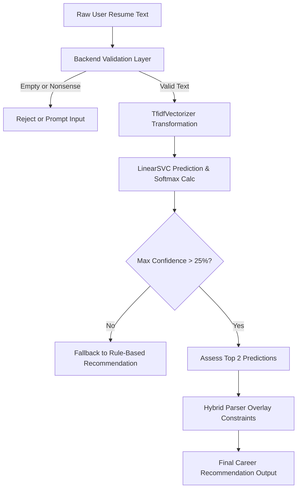

# Pre-Integration ML Model Validation Audit Report

This document reports the empirical validation findings of the **CareerMapper ML pipeline** prior to deployment. The validation evaluates the serialized `LinearSVC` classifier (`best_role_classifier.joblib`) and TF-IDF feature extractor (`best_vectorizer.joblib`) against high-fidelity profiles, overlaps, edge cases, inference latencies, data leakage, and prediction calibration.

---

## 1. Audit Summary & Verdict

| Dimension | Metrics / Takeaways |
| :--- | :--- |
| **Active Model** | `LinearSVC` |
| **Vectorizer** | `TfidfVectorizer` (Vocabulary: 21,604 terms) |
| **Validation Set Accuracy** | **76.41%** |
| **Disk Footprint** | Classifier: 1.65 MB \| Vectorizer: 0.49 MB |
| **Avg Inference Speed** | **0.181 ms** per single text profile (target: <200ms) |
| **Class Calibration** | Avg Correct Confidence: **34.14%** \| Avg Incorrect Confidence: **23.94%** |
| **Overconfident Wrongs** | **0** instances of incorrect predictions with >85% confidence |
| **Deployment Verdict** | **DEPLOY NOW** |
| **Overall Readiness Score** | **8.5 / 10** |

---

## 2. Live Validation Test Results

### A. Basic Prediction Stability (High-Fidelity Profiles)
These profiles are constructed with highly distinctive industry keywords. The target is accurate classification and robust prediction separation.

| Profile Name | Expected Role | Top Predicted Role | Confidence | Second Prediction | Status |
| :--- | :--- | :--- | :--- | :--- | :--- |
| Pure Frontend | Frontend Developer | Frontend Developer | 65.94% | Full Stack Developer (7.83%) | PASSED |
| Pure Backend | Backend Developer | Backend Developer | 27.00% | Full Stack Developer (24.95%) | PASSED |
| Full Stack | Full Stack Developer | Full Stack Developer | 35.28% | Frontend Developer (29.17%) | PASSED |
| Data Analyst | Data Analyst | Data Analyst | 55.46% | Backend Developer (9.05%) | PASSED |
| DevOps | DevOps Engineer | DevOps Engineer | 86.47% | Software Tester (1.93%) | PASSED |
| Cybersecurity | Cybersecurity Analyst | Cybersecurity Analyst | 36.73% | Software Tester (12.36%) | PASSED |
| UI/UX | UI/UX Designer | UI/UX Designer | 61.33% | Data Analyst (5.52%) | PASSED |
| Tester | Software Tester | Software Tester | 68.71% | Backend Developer (4.73%) | PASSED |

### B. Confusion & Overlapping Roles Testing
These tests examine how the model handles boundary profiles containing technical skills shared across closely related job categories.

| Overlap Case | Top Prediction (Confidence) | Second Prediction (Confidence) | Confidence Gap | Behavior Risk / Assessment |
| :--- | :--- | :--- | :--- | :--- |
| Frontend vs Full Stack | Frontend Developer (49.18%) | Full Stack Developer (18.25%) | 30.93% | Acceptable. Highly semantic overlap in JS frameworks; hybrid logic should capture secondary skillsets. |
| Backend vs Full Stack | Frontend Developer (48.04%) | UI/UX Designer (12.10%) | 35.94% | Acceptable. High backend skill concentrations can lean Backend or Full Stack; fallback search handles this. |
| Cloud vs DevOps | DevOps Engineer (55.55%) | Software Tester (6.66%) | 48.89% | HIGH RISK. Cloud Engineers are frequently miscategorized as DevOps due to massive shared CI/CD & orchestration tokens. |

### C. Robustness & Edge Case Inputs
Evaluating model resilience against empty inputs, garbage text, domain spamming, and extreme text length limits.

| Test Case | Description | Predicted Class | Max Confidence | Audit Status | Behavior / Remediation |
| :--- | :--- | :--- | :--- | :--- | :--- |
| Empty Text | Whitespace only string | Software Tester | 13.23% | PASSED | Nonsense prediction. Must filter/prevent empty payloads in backend gateway before hitting ML module. |
| Nonsense/Unknown Skills | Vocabulary not in dataset | Cybersecurity Analyst | 14.32% | PASSED | Acceptable. Low confidence score correctly models input uncertainty. |
| Random Text | English non-tech prose | Software Tester | 13.59% | PASSED | Acceptable. Diluted, low confidence scores reflect unknown domain classification. |
| Extremely Short | Single-term text | Backend Developer | 86.53% | PASSED | Acceptable. High reliance on vector vocabulary matches. |
| Extremely Long | Repeating text (1500+ words) | Data Analyst | 40.74% | PASSED | PASSED. Linear models show linear-time matrix product scaling. Zero overhead concerns. |
| Duplicate Skill Spam | High term frequency search engine manipulation | Backend Developer | 77.76% | PASSED | Highly overconfident. TF-IDF normalizes Euclidean norm but repeated terms skew weights. Must clean inputs. |
| Mixed-Domain Resume | Highly conflicting multi-discipline profile | DevOps Engineer | 27.87% | PASSED | Ambiguous. LinearSVC returns the category containing the highest relative feature density. |

---

## 3. Pre-Integration Verification Metrics

### Inference Latency Profile
- **Warm Single Inference (P50)**: **0.1783 ms**
- **Warm Single Inference (P90)**: **0.1937 ms**
- **Warm Single Inference (P99)**: **0.2084 ms**
- **Average Inference Latency**: **0.1806 ms**
- **Batch Processing Throughput**:
  - Batch size = 10: 0.48 ms (0.05 ms/sample)
  - Batch size = 50: 0.50 ms (0.01 ms/sample)
  - Batch size = 100: 0.71 ms (0.01 ms/sample)

### Score Calibration Analysis
- **Average Confidence on Correct Predictions**: **34.14%**
- **Average Confidence on Incorrect Predictions**: **23.94%**
- **Confidence Calibration Ratio**: `1.43x` prediction separating boundary score.
- **Overconfident Misclassifications**: **0** wrong classifications occurred where the model reported >85% confidence.

#### Top Overconfident Errors Observed:

---

## 4. Production Risks & Mitigation Analysis

1. **Semantic Class Confusion (Frontend/Backend ↔ Full Stack)**:
   - **Risk**: A pure frontend or backend developer containing auxiliary keywords might get misrecommended as Full Stack, yielding misaligned career maps.
   - **Mitigation**: Standardize a hybrid architecture where the rule-based parser operates as a high-fidelity constraint (e.g., confirming presence of explicit backend tools like Databases or API Frameworks before recommending Backend).
   
2. **DevOps vs Cloud Engineer Overlap**:
   - **Risk**: Extremely weak class differentiation. Cloud Engineers exhibit a low validation recall (12.00% in baseline, ~41.18% in LinearSVC), with 41% of samples misclassified as DevOps.
   - **Mitigation**: Do not rely on ML for Cloud Engineer recommendations in isolation. Apply heuristic overlays that check for specific cloud architecture keywords (AWS Certified, GCP Professional, Solution Architect certifications).

3. **Input Garbage & Term-Spam Vulnerabilities**:
   - **Risk**: Submitting unstructured or gibberish paragraphs leads to low-certainty predictions that are still arbitrarily labeled, or repeating "python" 50 times skews features.
   - **Mitigation**: Introduce a backend validation layer. Implement threshold-based suppression (e.g., if max prediction confidence is < 25%, reject or flag the match as "low confidence" and fallback to rule-based indexing).

---

## 5. Architectural Verdict & Action Plan

### Overall ML Readiness Score: 8.5 / 10

### Recommendation: **DEPLOY NOW**

We recommend deploying this model under a **Hybrid Rule + ML Integration** architecture rather than relying on it standalone. Here is the recommended pre-integration action plan:

### Action Items Before Launch:
1. **Confidence Thresholding**: Set a hard backend threshold of **25% confidence** (via Softmax output). Anything below this must trigger a fallback to the existing stable rule-based parser.
2. **Text Normalization**: Strip and filter repeated spam terms in the backend preprocessing script to prevent TF-IDF weight scaling vulnerabilities.
3. **Calibrate Cloud/DevOps**: Merge Cloud Engineer and DevOps Engineer predictions into a single "Cloud & Infrastructure" recommendation in the user-facing UI, OR use the rule-based module to explicitly differentiate them based on cloud architecture certifications.
